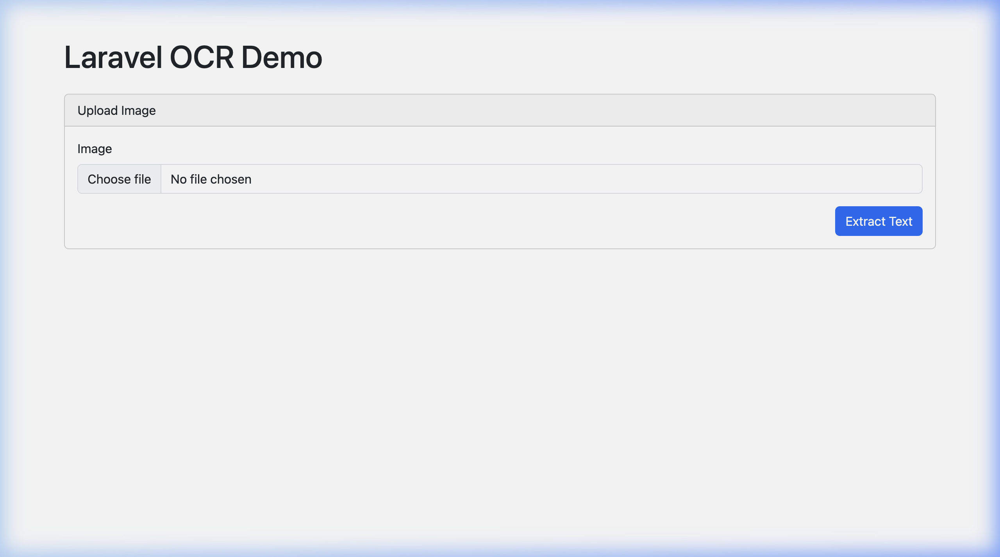

# Laravel OCR & Document Intelligence

[](https://packagist.org/packages/mayaram/laravel-ocr)
[](https://packagist.org/packages/mayaram/laravel-ocr)
[](https://packagist.org/packages/mayaram/laravel-ocr)

**Turn any image or PDF into structured, actionable data.**

A powerful, developer-friendly Laravel package that reads text from images and PDFs, understands the content, fixes scanning errors with AI, and delivers clean, structured data directly to your application.

> **Why this package?** Most OCR tools just give you a dump of raw text. This package gives you **typed DTOs**, **structured fields**, and **confidence scores**. It knows the difference between an Invoice Number and a Phone Number.

## 📸 Demo



---

## 📑 Table of Contents

- [✨ Features](#-features)
- [📐 Architecture](#-architecture)
- [🚀 Installation](#-installation)
  - [Install via Composer](#1-install-via-composer)
  - [Publish Configuration & Assets](#2-publish-configuration--assets)
  - [Publish Views (Optional)](#3-publish-views-optional)
  - [Install Tesseract (Default Driver)](#4-install-tesseract-default-driver)
- [⚙️ Configuration](#️-configuration)
  - [OCR Driver Selection](#ocr-driver-selection)
  - [Tesseract](#tesseract-offline--privacy-first--default)
  - [Google Cloud Vision](#google-cloud-vision)
  - [AWS Textract](#aws-textract)
  - [Azure Computer Vision](#azure-computer-vision)
  - [AI Cleanup (via Laravel AI SDK)](#ai-cleanup-via-laravel-ai-sdk)
  - [Queue Configuration](#queue-configuration)
  - [Storage & Security](#storage--security)
- [📖 Usage](#-usage)
  - [Simple Text Extraction](#1-simple-text-extraction)
  - [Smart Parsing (Structured Data via OcrResult DTO)](#2-smart-parsing-structured-data-via-ocrresult-dto)
  - [Batch Processing](#3-batch-processing)
  - [Working with Line Items & Tables](#4-working-with-line-items--tables)
  - [Templates](#5-templates)
  - [Workflows](#6-workflows)
  - [Switching Drivers at Runtime](#7-switching-drivers-at-runtime)
  - [Document Metadata Extraction](#8-document-metadata-extraction)
  - [Working with Processed Documents](#9-working-with-processed-documents)
- [🖥️ Artisan Commands](#️-artisan-commands)
  - [Create a Template](#create-a-template)
  - [Process a Document](#process-a-document)
- [🎨 Blade Component](#-blade-component)
- [🗄️ Database Schema](#️-database-schema)
- [🧩 OCR Driver Interface](#-ocr-driver-interface)
  - [Supported Formats by Driver](#supported-formats-by-driver)
  - [Building a Custom Driver](#building-a-custom-driver)
- [🤖 AI Cleanup Details](#-ai-cleanup-details)
  - [Basic Rules (No API Required)](#basic-rules-no-api-required)
  - [AI-Powered Cleanup (via Laravel AI SDK)](#ai-powered-cleanup-via-laravel-ai-sdk)
- [🧪 Testing](#-testing)
- [📄 API Reference](#-api-reference)
  - [LaravelOcr Facade](#laravelocr-facade-via-ocrmanager)
  - [DocumentParser](#documentparser-via-applaravel-ocrparser)
  - [OcrResult DTO](#ocrresult-dto)
  - [TemplateManager](#templatemanager-via-applaravel-ocrtemplates)
- [📄 License](#-license)

---

## ✨ Features

- **🧠 Multi-Driver OCR Engine**: Seamlessly switch between **Tesseract** (offline/privacy-first), **Google Cloud Vision**, **AWS Textract**, or **Azure Computer Vision** drivers.
- **🤖 AI-Powered Cleanup**: Uses `laravel/ai` SDK with the `CleanupAgent` to fix OCR typos (e.g., `arnount` → `amount`, `nurnber` → `number`) and normalize data formats. Supports **OpenAI, Anthropic, Gemini, Ollama, DeepSeek, Groq, Mistral**, and more.
- **📦 Typed DTOs**: Returns an `OcrResult` data transfer object with `text`, `confidence`, `bounds`, and `metadata` properties — not just raw arrays.
- **📑 Advanced Invoice Extraction**: Specialized algorithms to extract line items (quantity, description, unit price, total), subtotals, tax, shipping, and totals from complex invoice layouts.
- **🔍 Auto-Classification**: Automatically detects document types (Invoice, Receipt, Contract, Purchase Order, Shipping, General) using keyword scoring.
- **📋 Reusable Templates**: Define document templates with regex patterns and positional extraction to target specific fields. Supports template creation, import/export, and auto-matching.
- **⚡ Workflows**: Define custom processing pipelines per document type in your config (e.g., "If Invoice → Extract Tables → Verify Required Fields").
- **🎨 Blade Component**: Built-in `<x-laravel-ocr::document-preview>` component to visualize results with bounding box overlays, inline editing, and data export.
- **🖥️ Artisan Commands**: CLI tools for template creation (`laravel-ocr:create-template`) and document processing (`laravel-ocr:process`).
- **💾 Database Persistence**: Optionally save processed results to the `ocr_processed_documents` table with template associations, confidence scores, and processing times.
- **🔒 Enterprise Security**: Encrypted storage options, MIME-type validation, malware scanning, and full offline support for sensitive data.

---

## 📐 Architecture

```
src/
├── Agents/
│   └── CleanupAgent.php          # Laravel AI SDK agent for OCR post-processing
├── Console/Commands/
│   ├── CreateTemplateCommand.php  # artisan laravel-ocr:create-template
│   └── ProcessDocumentCommand.php # artisan laravel-ocr:process
├── Contracts/
│   └── OCRDriver.php             # Interface: extract, extractTable, extractBarcode, extractQRCode, etc.
├── Drivers/
│   ├── TesseractDriver.php       # Offline OCR via thiagoalessio/tesseract_ocr
│   ├── GoogleVisionDriver.php    # Google Cloud Vision API
│   ├── AWSTextractDriver.php     # AWS Textract API
│   └── AzureOCRDriver.php        # Azure Computer Vision API
├── DTOs/
│   └── OcrResult.php             # Readonly DTO: text, confidence, bounds, metadata
├── Enums/
│   ├── DocumentType.php          # Invoice, Receipt, Contract, PurchaseOrder, Shipping, General
│   └── OcrDriver.php             # Tesseract, GoogleVision, AWSTextract, Azure
├── Exceptions/
│   ├── AICleanupException.php
│   ├── DocumentParserException.php
│   └── OCRException.php
├── Facades/
│   └── LaravelOcr.php            # Facade for OCRManager
├── Models/
│   ├── DocumentTemplate.php      # Template definition with fields relationship
│   ├── ProcessedDocument.php     # Stored OCR results with field accessors
│   └── TemplateField.php         # Individual field definition with validation rules
├── Services/
│   ├── OCRManager.php            # Driver manager (extends Illuminate\Support\Manager)
│   ├── AICleanupService.php      # AI cleanup + basic rule-based typo correction
│   ├── DocumentParser.php        # Main parsing engine with field/table/metadata extraction
│   └── TemplateManager.php       # Template CRUD, import/export, auto-matching
└── LaravelOcrServiceProvider.php  # Service provider: bindings, config, migrations, views, commands
```

---

## 🚀 Installation

Requires **PHP 8.4+** and **Laravel 10+ / 11 / 12**.

### 1. Install via Composer

```bash
composer require mayaram/laravel-ocr
```

### 2. Publish Configuration & Assets

```bash
php artisan vendor:publish --tag=laravel-ocr-config
php artisan vendor:publish --tag=laravel-ocr-migrations
php artisan migrate
```

### 3. Publish Views (Optional)

```bash
php artisan vendor:publish --tag=laravel-ocr-views
```

### 4. Install Tesseract (Default Driver)

```bash
# macOS
brew install tesseract

# Ubuntu/Debian
sudo apt-get install tesseract-ocr

# Verify installation
tesseract --version
```

---

## ⚙️ Configuration

Set your preferred driver and credentials in your `.env` file.

### OCR Driver Selection

```env
# Options: tesseract, google_vision, aws_textract, azure
LARAVEL_OCR_DRIVER=tesseract
```

### Tesseract (Offline / Privacy-First — Default)

All processing happens on your server. No data leaves your infrastructure.

```env
LARAVEL_OCR_DRIVER=tesseract
TESSERACT_BINARY=/usr/bin/tesseract
TESSERACT_LANGUAGE=eng
TESSERACT_TIMEOUT=60
```

### Google Cloud Vision

```env
LARAVEL_OCR_DRIVER=google_vision
GOOGLE_VISION_KEY_FILE=/path/to/service-account.json
GOOGLE_VISION_PROJECT_ID=your-project-id
```

> Requires: `composer require google/cloud-vision`

### AWS Textract

```env
LARAVEL_OCR_DRIVER=aws_textract
AWS_ACCESS_KEY_ID=your-key
AWS_SECRET_ACCESS_KEY=your-secret
AWS_DEFAULT_REGION=us-east-1
```

> Included: `aws/aws-sdk-php` is a core dependency.

### Azure Computer Vision

```env
LARAVEL_OCR_DRIVER=azure
AZURE_OCR_ENDPOINT=https://your-resource.cognitiveservices.azure.com
AZURE_OCR_KEY=your-subscription-key
AZURE_OCR_VERSION=3.2
```

### AI Cleanup (via Laravel AI SDK)

Enable AI-powered OCR post-processing to fix scanning errors and normalize data formats. The package uses `laravel/ai` with a dedicated `CleanupAgent` that supports multiple LLM providers.

```env
LARAVEL_OCR_AI_CLEANUP=true
LARAVEL_OCR_AI_PROVIDER=openai
LARAVEL_OCR_AI_TIMEOUT=60
# Optional: Set a default custom prompt for all AI cleanup calls
# LARAVEL_OCR_AI_CUSTOM_PROMPT="Extract all amounts in INR. Format names in Title Case."
```

#### Supported AI Providers

Set the API key for your chosen provider:

| Provider       | Env Variable           | Driver Key   |
| -------------- | ---------------------- | ------------ |
| OpenAI         | `OPENAI_API_KEY`       | `openai`     |
| Anthropic      | `ANTHROPIC_API_KEY`    | `anthropic`  |
| Google Gemini  | `GEMINI_API_KEY`       | `gemini`     |
| Ollama (Local) | `OLLAMA_API_KEY`       | `ollama`     |
| DeepSeek       | `DEEPSEEK_API_KEY`     | `deepseek`   |
| Groq           | `GROQ_API_KEY`         | `groq`       |
| Mistral        | `MISTRAL_API_KEY`      | `mistral`    |
| Azure OpenAI   | `AZURE_OPENAI_API_KEY` | `azure`      |
| Cohere         | `COHERE_API_KEY`       | `cohere`     |
| OpenRouter     | `OPENROUTER_API_KEY`   | `openrouter` |
| xAI            | `XAI_API_KEY`          | `xai`        |
| Jina           | `JINA_API_KEY`         | `jina`       |
| VoyageAI       | `VOYAGEAI_API_KEY`     | `voyageai`   |
| ElevenLabs     | `ELEVENLABS_API_KEY`   | `eleven`     |

### Queue Configuration

Process documents asynchronously:

```env
LARAVEL_OCR_QUEUE_ENABLED=false
LARAVEL_OCR_QUEUE_CONNECTION=default
LARAVEL_OCR_QUEUE_NAME=ocr-processing
```

### Storage & Security

```env
LARAVEL_OCR_STORAGE_DISK=local
LARAVEL_OCR_ENCRYPT_DATA=false
LARAVEL_OCR_SCAN_MALWARE=false
```

---

## 📖 Usage

### 1. Simple Text Extraction

The `LaravelOcr` facade provides a simple entry point via the `OCRManager`.

```php
use Mayaram\LaravelOcr\Facades\LaravelOcr;

// Extract from a local file path
$result = LaravelOcr::extract('/path/to/document.png');
echo $result['text'];
// "INVOICE #1001..."

// Extract from an UploadedFile
$result = LaravelOcr::extract(request()->file('document'));

// Extract a table
$tableResult = LaravelOcr::extractTable('/path/to/invoice.png');
foreach ($tableResult['table'] as $row) {
    echo implode(' | ', $row) . "\n";
}
```

### 2. Smart Parsing (Structured Data via `OcrResult` DTO)

For powerful data extraction, use the `DocumentParser`. It returns a typed `OcrResult` DTO with `text`, `confidence`, `bounds`, and `metadata` properties.

```php
use Mayaram\LaravelOcr\DTOs\OcrResult;

/** @var \Mayaram\LaravelOcr\Services\DocumentParser $parser */
$parser = app('laravel-ocr.parser');

$result = $parser->parse('storage/invoices/inv-2024.pdf', [
    'document_type' => 'invoice',
    'use_ai_cleanup' => true,
    'save_to_database' => true,
]);

// Access the OcrResult DTO properties
echo $result->text;                                  // Full extracted text
echo $result->confidence;                            // e.g., 0.98
echo $result->metadata['processing_time'];           // e.g., 1.2
echo $result->metadata['document_type'];             // "invoice"
echo $result->metadata['ai_cleanup_used'];           // true

// Access structured fields
$fields = $result->metadata['fields'];
$invoiceNumber = $fields['invoice_number']['value'];
$totalAmount = $fields['totals']['total']['amount'];
```

### 3. Batch Processing

Process multiple documents at once:

```php
$parser = app('laravel-ocr.parser');

$results = $parser->parseBatch([
    'storage/invoices/inv-001.pdf',
    'storage/invoices/inv-002.pdf',
    'storage/invoices/inv-003.pdf',
], ['document_type' => 'invoice']);

foreach ($results as $result) {
    echo $result->text . "\n---\n";
}
```

### 4. Working with Line Items & Tables

The package includes an **Advanced Invoice Extractor** capable of parsing complex invoice tables into structured arrays.

```php
$result = $parser->parse($invoicePath, [
    'document_type' => 'invoice',
]);

// Line items are extracted automatically for invoices
$lineItems = $result->metadata['fields']['line_items'] ?? [];

foreach ($lineItems as $item) {
    echo "{$item['description']}: {$item['quantity']} x \${$item['unit_price']} = \${$item['total']}\n";
}
// Output:
// Web Hosting: 12 x $10.00 = $120.00
// Domain Name: 1 x $15.00 = $15.00

// Invoice totals
$totals = $result->metadata['fields']['totals'] ?? [];
echo "Subtotal: " . ($totals['subtotal']['formatted'] ?? 'N/A');
echo "Tax: " . ($totals['tax']['formatted'] ?? 'N/A');
echo "Total: " . ($totals['total']['formatted'] ?? 'N/A');
```

### 5. Templates

Define reusable templates to target specific fields using regex patterns. Templates are stored in the database and support import/export.

```php
use Mayaram\LaravelOcr\Facades\LaravelOcr;

// 1. Create a Template
$templateManager = app('laravel-ocr.templates');

$template = $templateManager->create([
    'name' => 'TechCorp Invoice',
    'type' => 'invoice',
    'description' => 'Template for TechCorp invoices',
    'fields' => [
        [
            'key' => 'order_id',
            'label' => 'Order ID',
            'pattern' => '/Order\s*ID:\s*([A-F0-9]+)/i',
            'type' => 'string',
            'validators' => ['required' => true],
        ],
        [
            'key' => 'total_amount',
            'label' => 'Total Amount',
            'pattern' => '/Total:\s*\$?([\d,]+\.?\d*)/i',
            'type' => 'currency',
        ],
    ],
]);

// 2. Apply a template during extraction
$result = LaravelOcr::extractWithTemplate($file, $template->id);

// 3. Auto-detect template based on content
$parser = app('laravel-ocr.parser');
$result = $parser->parse($file, ['auto_detect_template' => true]);

// 4. Export / Import templates
$json = $templateManager->exportTemplate($template->id);
$imported = $templateManager->importTemplate('/path/to/template.json');

// 5. Duplicate a template
$clone = $template->duplicate('TechCorp Invoice v2');
```

### 6. Workflows

Configure processing pipelines in `config/laravel-ocr.php` to standardize how different document types are handled.

```php
// config/laravel-ocr.php
'workflows' => [
    'invoice' => [
        'options' => [
            'use_ai_cleanup' => true,
            'auto_detect_template' => true,
            'extract_tables' => true,
        ],
        'post_processors' => [
            ['class' => 'App\OCR\Processors\InvoiceProcessor'],
        ],
        'validators' => [
            ['type' => 'required_fields', 'fields' => ['invoice_number', 'total']],
        ],
    ],

    'receipt' => [
        'options' => [
            'use_ai_cleanup' => true,
            'extract_line_items' => true,
        ],
        'post_processors' => [
            ['class' => 'App\OCR\Processors\ReceiptProcessor'],
        ],
    ],
],
```

```php
// Usage
$parser = app('laravel-ocr.parser');
$result = $parser->parseWithWorkflow($file, 'invoice');
```

### 7. Switching Drivers at Runtime

```php
use Mayaram\LaravelOcr\Facades\LaravelOcr;

// Use Tesseract (default)
$result = LaravelOcr::driver('tesseract')->extract($document);

// Switch to AWS Textract for this request
$result = LaravelOcr::driver('aws_textract')->extract($document);

// Switch to Google Vision
$result = LaravelOcr::driver('google_vision')->extract($document);

```

### 8. Document Metadata Extraction

```php
$parser = app('laravel-ocr.parser');

$metadata = $parser->extractMetadata('/path/to/document.pdf');

// Returns:
// [
//     'file_name' => 'document.pdf',
//     'file_size' => 102400,
//     'mime_type' => 'application/pdf',
//     'created_at' => '2024-01-15 10:30:00',
//     'modified_at' => '2024-01-15 10:30:00',
//     'pdf_pages' => 3,
//     'pdf_author' => 'John Doe',
//     'pdf_title' => 'Q4 Invoice',
//     'pdf_creator' => 'Microsoft Word',
// ]
```

### 9. Working with Processed Documents

```php
use Mayaram\LaravelOcr\Models\ProcessedDocument;

// Query processed documents
$documents = ProcessedDocument::where('document_type', 'invoice')
    ->where('confidence_score', '>=', 0.7)
    ->latest()
    ->get();

foreach ($documents as $doc) {
    // Get a specific field value
    $invoiceNo = $doc->getFieldValue('invoice_number');

    // Get all field values as a flat array
    $allFields = $doc->getAllFieldValues();

    // Check if the result is valid (status=completed & confidence >= 0.7)
    if ($doc->isValid()) {
        // Process the document
    }
}
```

---

## 🖥️ Artisan Commands

### Create a Template

```bash
# Basic
php artisan laravel-ocr:create-template "My Invoice" invoice

# Interactive (prompts for fields, patterns, validators)
php artisan laravel-ocr:create-template "My Invoice" invoice --interactive
```

### Process a Document

```bash
# Basic processing
php artisan laravel-ocr:process /path/to/document.pdf

# With options
php artisan laravel-ocr:process /path/to/invoice.pdf \
    --type=invoice \
    --template=1 \
    --ai-cleanup \
    --save \
    --output=json
```

**Flags:**

| Flag              | Description                                |
| ----------------- | ------------------------------------------ |
| `--template=ID`   | Use a specific template                    |
| `--type=TYPE`     | Set document type (invoice, receipt, etc.) |
| `--ai-cleanup`    | Enable AI-powered cleanup                  |
| `--save`          | Save results to database                   |
| `--output=FORMAT` | Output format: `json` or `table` (default) |

---

## 🎨 Blade Component

Preview extracted documents and data directly in your UI with the built-in Alpine.js component.

```blade
<x-laravel-ocr::document-preview
    :document="$processedDocument"
    :show-overlay="true"
    :show-actions="true"
    :show-image="true"
/>
```

**Props:**

| Prop           | Type    | Default  | Description                                          |
| -------------- | ------- | -------- | ---------------------------------------------------- |
| `document`     | `array` | required | Document data with `url`, `documentId`, and `fields` |
| `show-overlay` | `bool`  | `false`  | Show bounding box overlays on the document           |
| `show-actions` | `bool`  | `true`   | Show Save/Export/Reprocess action buttons            |
| `show-image`   | `bool`  | `true`   | Use `` tag (`true`) or `<iframe>` (`false`)     |

**Expected Document Structure:**

```php
$processedDocument = [
    'url' => asset('storage/documents/invoice.pdf'),
    'documentId' => $document->id,
    'fields' => [
        [
            'key' => 'invoice_number',
            'label' => 'Invoice Number',
            'value' => 'INV-2024-001',
            'confidence' => 0.95,
            'bounds' => ['x' => 100, 'y' => 50, 'width' => 200, 'height' => 30],
        ],
        // ...more fields
    ],
];
```

**Features:**

- Click fields to highlight them on the document
- Inline editing of extracted values
- Confidence badges: 🟢 High (≥80%), 🟡 Medium (≥60%), 🔴 Low (<60%)
- Export extracted data as JSON
- Reprocess documents with one click

---

## 🗄️ Database Schema

The package creates three tables:

### `ocr_templates`

| Column        | Type       | Description                            |
| ------------- | ---------- | -------------------------------------- |
| `id`          | bigint     | Primary key                            |
| `name`        | string     | Template name                          |
| `description` | text       | Optional description                   |
| `type`        | string(50) | Document type (invoice, receipt, etc.) |
| `layout`      | json       | Layout configuration                   |
| `is_active`   | boolean    | Whether template is active             |
| `version`     | string(10) | Template version (default: 1.0)        |

### `ocr_template_fields`

| Column          | Type       | Description                                               |
| --------------- | ---------- | --------------------------------------------------------- |
| `id`            | bigint     | Primary key                                               |
| `template_id`   | foreignId  | References `ocr_templates`                                |
| `key`           | string(50) | Field identifier (snake_case)                             |
| `label`         | string     | Human-readable label                                      |
| `type`          | string(30) | Field type: string, numeric, date, currency, email, phone |
| `pattern`       | text       | Regex pattern for extraction                              |
| `position`      | json       | Positional extraction config (line, start, end)           |
| `validators`    | json       | Validation rules (required, regex, length, type)          |
| `default_value` | string     | Fallback value                                            |
| `order`         | integer    | Display order                                             |

### `ocr_processed_documents`

| Column              | Type         | Description                   |
| ------------------- | ------------ | ----------------------------- |
| `id`                | bigint       | Primary key                   |
| `original_filename` | string       | Original file name            |
| `document_type`     | string(50)   | Detected or specified type    |
| `extracted_data`    | json         | Full extraction result        |
| `template_id`       | foreignId    | Template used (nullable)      |
| `confidence_score`  | decimal(3,2) | Overall confidence            |
| `processing_time`   | decimal(8,3) | Time in seconds               |
| `user_id`           | bigint       | User who processed (nullable) |
| `status`            | string(20)   | completed, failed, etc.       |
| `error_message`     | text         | Error details if failed       |

---

## 🧩 OCR Driver Interface

All drivers implement the `Mayaram\LaravelOcr\Contracts\OCRDriver` interface:

```php
interface OCRDriver
{
    public function extract($document, array $options = []): array;
    public function extractTable($document, array $options = []): array;
    public function extractBarcode($document, array $options = []): array;
    public function extractQRCode($document, array $options = []): array;
    public function getSupportedLanguages(): array;
    public function getSupportedFormats(): array;
}
```

### Supported Formats by Driver

| Format   | Tesseract | Google Vision | AWS Textract | Azure |
| -------- | --------- | ------------- | ------------ | ----- |
| JPG/JPEG | ✅        | ✅            | ✅           | ✅    |
| PNG      | ✅        | ✅            | ✅           | ✅    |
| PDF      | ✅        | ✅            | ✅           | ✅    |
| TIFF     | ✅        | ✅            | ❌           | ✅    |
| BMP      | ✅        | ✅            | ❌           | ✅    |
| GIF      | ❌        | ✅            | ❌           | ❌    |
| WebP     | ❌        | ✅            | ❌           | ❌    |

### Building a Custom Driver

```php
use Mayaram\LaravelOcr\Contracts\OCRDriver;

class MyCustomDriver implements OCRDriver
{
    public function extract($document, array $options = []): array
    {
        // Your implementation
        return [
            'text' => 'extracted text',
            'confidence' => 0.95,
            'bounds' => [],
            'metadata' => ['engine' => 'custom'],
        ];
    }

    public function extractTable($document, array $options = []): array { /* ... */ }
    public function extractBarcode($document, array $options = []): array { /* ... */ }
    public function extractQRCode($document, array $options = []): array { /* ... */ }
    public function getSupportedLanguages(): array { return ['en' => 'English']; }
    public function getSupportedFormats(): array { return ['jpg', 'png', 'pdf']; }
}
```

---

## 🤖 AI Cleanup Details

The `AICleanupService` provides two modes:

### Basic Rules (No API Required)

Set `provider` to `basic` to use built-in typo correction and field normalization without any AI provider:

```php
$result = $parser->parse($document, [
    'use_ai_cleanup' => true,
    'provider' => 'basic',
]);
```

**Built-in corrections:**

- Common OCR typos: `invOice` → `invoice`, `arnount` → `amount`, `nurnber` → `number`, `custorner` → `customer`, `payrnent` → `payment`
- OCR pattern fixes: `rn` → `m`, `O` before numbers → `0`, `l` before numbers → `1`
- Field normalization by type: numeric, date (→ `Y-m-d`), currency, email, phone

### AI-Powered Cleanup (via Laravel AI SDK)

Uses the `CleanupAgent` with your configured LLM provider for intelligent correction:

```php
$result = $parser->parse($document, [
    'use_ai_cleanup' => true,
    // Uses LARAVEL_OCR_AI_PROVIDER from config
]);
```

The agent is instructed to:

1. Fix typos and OCR errors contextually
2. Standardize formats (dates to `YYYY-MM-DD`, currency to decimal)
3. Preserve values it can't confidently fix
4. Return valid JSON matching the input structure

### Custom Prompt

You can pass additional instructions to the AI cleanup agent to customize its behavior:

```php
// Per-call custom prompt
$result = $parser->parse($document, [
    'use_ai_cleanup' => true,
    'custom_prompt' => 'Extract all amounts in INR. Normalize phone numbers to +91 format.',
]);
```

Or set a default custom prompt in `config/laravel-ocr.php`:

```php
'ai_cleanup' => [
    'custom_prompt' => 'Always extract Hindi text. Format dates as DD/MM/YYYY.',
],
```

> The custom prompt is appended as **"Additional Instructions"** to the default cleanup prompt, so the base OCR correction behavior is always preserved.

---

## 🧪 Testing

The package uses **Pest** for testing with three test suites:

```bash
# Run all tests
composer test

# Or directly with Pest
./vendor/bin/pest

# Run specific suite
./vendor/bin/pest --testsuite=Unit
./vendor/bin/pest --testsuite=Feature
./vendor/bin/pest --testsuite=Integration
```

Tests use SQLite in-memory database automatically via `phpunit.xml` configuration.

---

## 📄 API Reference

### `LaravelOcr` Facade (via `OCRManager`)

| Method                                                  | Returns     | Description                 |
| ------------------------------------------------------- | ----------- | --------------------------- |
| `extract($document, $options)`                          | `array`     | Extract text from document  |
| `extractWithTemplate($document, $templateId, $options)` | `array`     | Extract and apply template  |
| `extractTable($document, $options)`                     | `array`     | Extract table data          |
| `extractBarcode($document, $options)`                   | `array`     | Extract barcode             |
| `extractQRCode($document, $options)`                    | `array`     | Extract QR code             |
| `driver($name)`                                         | `OCRDriver` | Switch to a specific driver |

### `DocumentParser` (via `app('laravel-ocr.parser')`)

| Method                                    | Returns       | Description                  |
| ----------------------------------------- | ------------- | ---------------------------- |
| `parse($document, $options)`              | `OcrResult`   | Full parsing pipeline        |
| `parseBatch($documents, $options)`        | `OcrResult[]` | Process multiple documents   |
| `parseWithWorkflow($document, $workflow)` | `OcrResult`   | Parse using a named workflow |
| `extractMetadata($document)`              | `array`       | Extract file & PDF metadata  |

### `OcrResult` DTO

| Property     | Type     | Description                                                 |
| ------------ | -------- | ----------------------------------------------------------- |
| `text`       | `string` | Full extracted text                                         |
| `confidence` | `float`  | Overall confidence score (0–1)                              |
| `bounds`     | `array`  | Bounding box / layout data                                  |
| `metadata`   | `array`  | Processing time, document type, fields, template used, etc. |

### `TemplateManager` (via `app('laravel-ocr.templates')`)

| Method                                       | Returns             | Description                      |
| -------------------------------------------- | ------------------- | -------------------------------- |
| `create($data)`                              | `DocumentTemplate`  | Create a template with fields    |
| `applyTemplate($extractedData, $templateId)` | `array`             | Apply template to extracted data |
| `findTemplateByContent($text)`               | `?DocumentTemplate` | Auto-detect matching template    |
| `importTemplate($filePath)`                  | `DocumentTemplate`  | Import from JSON file            |
| `exportTemplate($templateId)`                | `string`            | Export as JSON string            |

---

## 📄 License

The MIT License (MIT). Please see [License File](LICENSE.md) for more information.
